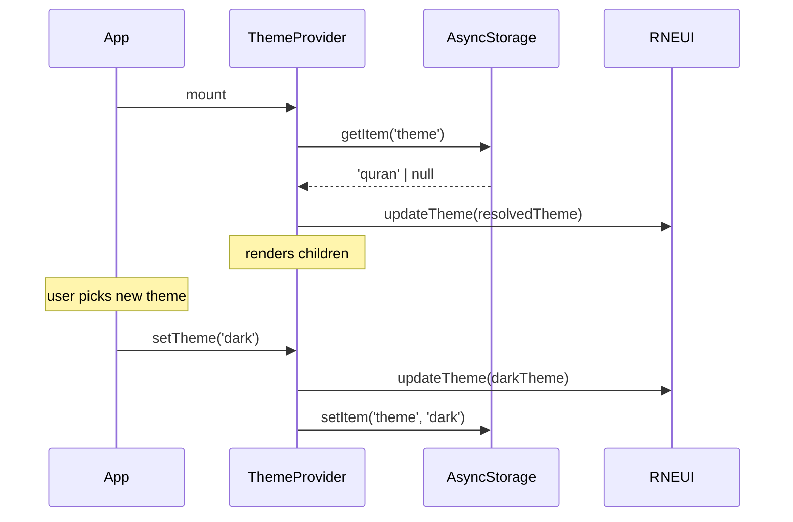

# Design Document: App Modernization

## Overview

This document describes the technical design for modernizing the Khatmah app's theme system, navigation structure, shared style layer, and settings screen. The changes replace the static custom `ThemeProvider` with `@rneui/themed`'s `ThemeProvider`, introduce a three-palette theme system with persistence, convert the app-level layout from a Stack to a bottom Tab navigator, add a `useSharedStyles` hook, and introduce a Settings/Profile screen.

The design is intentionally additive: existing screens continue to work during migration, and the `useTheme()` call signature is preserved so no call sites need to change in the first pass.

---

## Architecture

### High-Level Component Tree (after migration)

```mermaid
graph TD
  A[app/_layout.tsx<br/>RootLayout] --> B[QueryClientProvider]
  B --> C[RneuiThemeProvider<br/>+ persistence]
  C --> D[Stack screenOptions headerShown=false]
  D --> E[app/(app)/_layout.tsx<br/>Tabs navigator]
  E --> F[Home Tab<br/>Stack → index.tsx]
  E --> G[Settings Tab<br/>settings.tsx]
  F --> H[khatmah/[id]/index.tsx]
  H --> I[khatmah/[id]/juz/[num].tsx]
```

### Theme Persistence Flow



---

## Components and Interfaces

### 1. `theme/rneui.ts` — RNEUI theme definitions

Exports three RNEUI `FullTheme`-compatible objects (`defaultTheme`, `darkTheme`, `quranTheme`) and a `ThemeName` union type.

```ts
export type ThemeName = 'default' | 'dark' | 'quran'

export const defaultTheme: Theme  // light green
export const darkTheme: Theme     // dark backgrounds
export const quranTheme: Theme    // warm parchment

export const themeMap: Record<ThemeName, Theme>
```

Each theme object maps existing token names into RNEUI's `colors` shape plus custom extension fields for `typography`, `spacing`, and `shadows`.

### 2. `theme/ThemeProvider.tsx` — replaced implementation

The new provider wraps `@rneui/themed`'s `ThemeProvider`, loads the persisted theme name from `AsyncStorage` on mount, and exposes a `setTheme(name: ThemeName)` function via a separate context.

```ts
// Public API — unchanged call site
export const useTheme: () => {
  colors: ColorTokens
  typography: typeof typography
  spacing: typeof spacing
  shadows: typeof shadows
}

// New — for Settings screen only
export const useThemeSwitcher: () => {
  themeName: ThemeName
  setTheme: (name: ThemeName) => void
}

export function ThemeProvider({ children }: { children: React.ReactNode }): JSX.Element
```

`useTheme()` is implemented by calling RNEUI's `useTheme()` internally and re-mapping the result to the existing token shape, so all existing call sites (`colors`, `typography`, `spacing`, `shadows`) continue to work without modification.

### 3. `app/(app)/_layout.tsx` — Tabs navigator

Replaces the current `Stack` with Expo Router's `Tabs`. The Home tab hosts a nested `Stack` for deep navigation (khatmah detail, juz screens). The Settings tab renders `settings.tsx` directly.

```ts
// Tab configuration
<Tabs screenOptions={{ tabBarStyle: { backgroundColor: colors.background }, ... }}>
  <Tabs.Screen name="index" options={{ title: t('nav.home'), tabBarIcon: ... }} />
  <Tabs.Screen name="settings" options={{ title: t('nav.settings'), tabBarIcon: ... }} />
</Tabs>
```

Nested stack screens (`khatmah/[id]`, `khatmah/[id]/juz/[num]`) are declared as `href: null` or via a nested `Stack` inside the Home tab so the tab bar remains visible.

### 4. `hooks/useSharedStyles.ts`

Returns a memoized `StyleSheet` derived from the active theme. Re-computes only when the theme changes.

```ts
export function useSharedStyles(): {
  screen: ViewStyle      // flex:1, backgroundColor: colors.background, safe-area padding
  card: ViewStyle        // surface bg, border, borderRadius 12, padding md, shadow
  row: ViewStyle         // flexDirection row, alignItems center
  sectionTitle: TextStyle // fontSizeLG, fontWeightBold, colors.text
  mutedText: TextStyle   // fontSizeSM, colors.textMuted
}
```

### 5. `app/(app)/settings.tsx` — Settings screen

New screen with three sections rendered as RNEUI `ListItem` groups separated by `Divider`:

| Section | Components | Behaviour |
|---|---|---|
| Profile | `Input` (full_name), `Button` (Save) | Calls `supabase.from('profiles').update(...)`, shows inline error on failure, loading state on button |
| Theme | Three `ListItem.CheckBox` rows | Calls `setTheme(name)` immediately on tap |
| Account | `Button` (Sign Out) | Calls `auth.signOut()`, navigates to `/(auth)/sign-in` |

---

## Data Models

### ThemeName

```ts
type ThemeName = 'default' | 'dark' | 'quran'
```

Stored as a plain string in `AsyncStorage` under the key `'khatmah:theme'`.

### RNEUI Theme Extension

RNEUI's theme is extended with custom tokens so `useTheme()` from RNEUI returns typed access to all design tokens:

```ts
declare module '@rneui/themed' {
  export interface Colors {
    // existing RNEUI colors are kept
    textMuted: string
    border: string
  }
  export interface Theme {
    typography: typeof typography
    spacing: typeof spacing
    shadows: typeof shadows
  }
}
```

### Color Palettes

| Token | default | dark | quran |
|---|---|---|---|
| `primary` | `#4CAF50` | `#66BB6A` | `#8B6914` |
| `background` | `#FAFAFA` | `#121212` | `#F5E6C8` |
| `surface` | `#FFFFFF` | `#1E1E1E` | `#FDF3DC` |
| `text` | `#1A1A1A` | `#E0E0E0` | `#2C1810` |
| `textMuted` | `#757575` | `#9E9E9E` | `#7A5C3A` |
| `border` | `#E0E0E0` | `#333333` | `#D4B896` |
| `error` | `#D32F2F` | `#EF5350` | `#C62828` |
| `success` | `#388E3C` | `#43A047` | `#5D4037` |

All text/background pairs satisfy ≥ 4.5:1 contrast ratio (WCAG AA).

### AsyncStorage Key

```
'khatmah:theme'  →  ThemeName string | undefined
```

---

## Correctness Properties

*A property is a characteristic or behavior that should hold true across all valid executions of a system — essentially, a formal statement about what the system should do. Properties serve as the bridge between human-readable specifications and machine-verifiable correctness guarantees.*

### Property 1: Theme persistence round-trip

*For any* valid `ThemeName` (`'default'`, `'dark'`, `'quran'`), after calling `setTheme(name)` and re-mounting the `ThemeProvider` (simulating an app restart with the same `AsyncStorage` state), the active theme name SHALL equal the name that was originally set.

**Validates: Requirements 2.4, 2.6**

### Property 2: Default theme fallback

*For any* value returned by `AsyncStorage` for the theme key that is not a valid `ThemeName` (including `null`, `undefined`, empty string, or arbitrary garbage), the `ThemeProvider` SHALL resolve to the `'default'` theme.

**Validates: Requirements 2.5**

### Property 3: Theme tokens completeness

*For any* `ThemeName`, the resolved theme object SHALL contain non-null, non-undefined values for every token in `{ colors, typography, spacing, shadows }`, with `colors` containing all eight color keys (`primary`, `background`, `surface`, `text`, `textMuted`, `border`, `error`, `success`).

**Validates: Requirements 2.1, 2.3**

### Property 4: Tab bar colors match active theme

*For any* `ThemeName`, the tab navigator's `tabBarStyle.backgroundColor` SHALL equal the `background` color token of that theme, and the `tabBarActiveTintColor` SHALL equal the `primary` token.

**Validates: Requirements 1.5**

### Property 5: Shared styles reflect active theme

*For any* `ThemeName`, calling `useSharedStyles()` under that theme SHALL return style objects whose color values exactly match the corresponding tokens of that theme (e.g., `card.backgroundColor === colors.surface`, `sectionTitle.color === colors.text`, `mutedText.color === colors.textMuted`).

**Validates: Requirements 3.2, 3.3**

### Property 6: Contrast ratio compliance

*For any* `ThemeName`, the contrast ratio between the `text` token and the `background` token, and between the `textMuted` token and the `surface` token, SHALL each be ≥ 4.5:1.

**Validates: Requirements 2.7**

### Property 7: Profile update round-trip

*For any* non-empty `full_name` string, after the Settings screen calls the Supabase `profiles` update with that value, the mocked update handler SHALL have been invoked with the exact string, and the screen SHALL display a success state (no error message visible).

**Validates: Requirements 4.2**

### Property 8: Inline error display on update failure

*For any* error message string returned by a failing Supabase `profiles` update mock, the Settings screen SHALL display that error message inline (without navigating away), and the `full_name` input SHALL remain editable.

**Validates: Requirements 4.3**

---

## Error Handling

| Scenario | Handling |
|---|---|
| `AsyncStorage.getItem` fails on launch | Catch error, fall back to `'default'` theme silently |
| `AsyncStorage.setItem` fails on theme change | Theme is applied in-memory; log warning; retry on next change |
| Supabase `profiles` update fails | Display inline error string below the Save button; keep field editable |
| Supabase `profiles` update times out | Same as failure; surface a user-friendly message |
| `signOut` fails | Log error; navigate to sign-in anyway to avoid stuck state |
| Theme token missing for a palette | TypeScript compile-time error via strict module augmentation |

---

## Testing Strategy

### Unit Tests (example-based)

- `theme/rneui.ts`: verify each palette exports all required color tokens with correct types
- `ThemeProvider`: verify `useTheme()` returns the correct token shape for each theme
- `useSharedStyles`: verify returned style groups contain expected keys
- Settings screen: verify Save button is disabled while update is pending; verify error message appears on failure

### Property-Based Tests

Uses **fast-check** (compatible with Jest/Vitest in RN projects).

Each property test runs a minimum of **100 iterations**.

- **Property 1** — `fc.constantFrom('default', 'dark', 'quran')` → set → simulate restart → assert restored name equals set name
  - Tag: `Feature: app-modernization, Property 1: theme persistence round-trip`
- **Property 2** — `fc.oneof(fc.constant(null), fc.constant(undefined), fc.constant(''), fc.string())` filtered to non-ThemeName values → assert resolved theme is `'default'`
  - Tag: `Feature: app-modernization, Property 2: default theme fallback`
- **Property 3** — `fc.constantFrom('default', 'dark', 'quran')` → resolve theme → assert all token keys present and non-null
  - Tag: `Feature: app-modernization, Property 3: theme tokens completeness`
- **Property 4** — `fc.constantFrom('default', 'dark', 'quran')` → render tab navigator → assert tabBarStyle colors match theme tokens
  - Tag: `Feature: app-modernization, Property 4: tab bar colors match active theme`
- **Property 5** — `fc.constantFrom('default', 'dark', 'quran')` → render useSharedStyles() → assert style color values match theme tokens
  - Tag: `Feature: app-modernization, Property 5: shared styles reflect active theme`
- **Property 6** — `fc.constantFrom('default', 'dark', 'quran')` → compute contrast ratios → assert ≥ 4.5:1
  - Tag: `Feature: app-modernization, Property 6: contrast ratio compliance`
- **Property 7** — `fc.string({ minLength: 1 })` as full_name → mock Supabase update → assert handler called with exact value and no error shown
  - Tag: `Feature: app-modernization, Property 7: profile update round-trip`
- **Property 8** — `fc.string({ minLength: 1 })` as error message → mock Supabase failure → assert error displayed inline and input remains editable
  - Tag: `Feature: app-modernization, Property 8: inline error display on update failure`

### Integration Tests

- End-to-end tab navigation: verify Home and Settings tabs are reachable and render correct screens
- Supabase profile update: verify real update call succeeds against local Supabase instance
