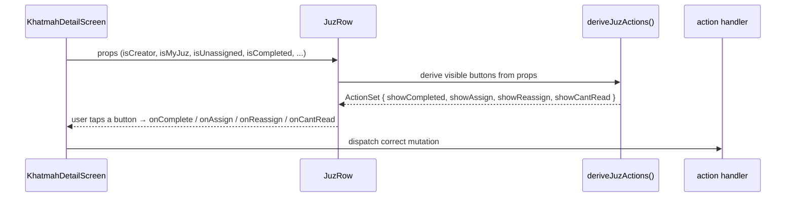

# Design Document: Juz Action Buttons

## Overview

Replace the single "Reassign" button on each `JuzRow` with up to four context-aware action buttons whose visibility is determined by the authenticated user's role (creator vs. participant) and the Juz' assignment state (unassigned / assigned-to-me / assigned-to-other / completed).

## Main Algorithm/Workflow



## Core Interfaces/Types

```typescript
/** Describes which action buttons are visible for a single JuzRow. */
interface JuzActionSet {
  showCompleted: boolean   // "Completed" — mark juz as finished
  showAssign: boolean      // "Assign"    — creator assigns unassigned juz
  showReassign: boolean    // "Reassign"  — creator reassigns assigned juz
  showCantRead: boolean    // "Can't Read"— assigned user requests help
}

/** Extended props for JuzRow after this change. */
interface JuzRowProps {
  // ── existing (unchanged) ──────────────────────────────────────────────────
  juzNum: number
  assignedName: string
  planbName: string | null
  isCompleted: boolean
  isHelpRequested: boolean
  isCreator: boolean
  isManualMode: boolean
  isMyJuz: boolean
  isUnassigned: boolean
  actionLoading: boolean
  instanceId?: string
  khatmahId?: string
  currentUserId?: string
  reassignPanel?: React.ReactNode
  onAdopt: () => void
  onSelfAssign: () => void

  // ── changed: onReassign now covers both assign and reassign flows ─────────
  onReassign: () => void   // opens ReassignPanel (used for both assign & reassign)

  // ── new callbacks ─────────────────────────────────────────────────────────
  onComplete: () => void   // triggers finish-juz mutation from parent
  onCantRead: () => void   // triggers mark-help-requested mutation from parent
}
```

## Key Functions with Formal Specifications

### `deriveJuzActions()`

```typescript
function deriveJuzActions(props: {
  isCreator: boolean
  isMyJuz: boolean
  isUnassigned: boolean
  isCompleted: boolean
  isManualMode: boolean
}): JuzActionSet
```

**Preconditions:**
- All boolean props are well-defined (not `undefined`)
- `isMyJuz` and `isUnassigned` are mutually exclusive (`!(isMyJuz && isUnassigned)`)

**Postconditions:**
- Returns a `JuzActionSet` with exactly the buttons that satisfy the visibility rules below
- If `isCompleted === true`, all four flags are `false` (no actions on a completed juz)
- `showAssign` is only `true` when `isManualMode === true`
- `showReassign` is only `true` when `isManualMode === true`

**Visibility rules (evaluated only when `!isCompleted`):**

| Button | Condition |
|---|---|
| `showCompleted` | `(isMyJuz \|\| isCreator) && !isUnassigned` |
| `showAssign` | `isCreator && isManualMode && isUnassigned` |
| `showReassign` | `isCreator && isManualMode && !isUnassigned` |
| `showCantRead` | `isMyJuz && !isHelpRequested` |

**Loop Invariants:** N/A (pure derivation, no loops)

### `handleComplete()` — in `KhatmahDetailScreen`

```typescript
const handleComplete = useCallback((juzNum: number) => void, [instance, currentUserId, finishJuz, t])
```

**Preconditions:**
- `instance` is non-null
- `currentUserId` is non-null
- `juzNum` is in range [1, 30]

**Postconditions:**
- Calls `finishJuz.mutate({ instanceId: instance.id, juzNum })`
- On success: active-instance query is invalidated
- On error: `Alert.alert` is shown with error message

### `handleCantRead()` — in `KhatmahDetailScreen`

```typescript
const handleCantRead = useCallback((juzNum: number) => void, [instance, markHelpRequested, t])
```

**Preconditions:**
- `instance` is non-null
- `juzNum` is in range [1, 30]

**Postconditions:**
- Calls `markHelpRequested.mutate({ instanceId: instance.id, juzNum })`
- On success: active-instance query is invalidated
- On error: `Alert.alert` is shown with error message

## Algorithmic Pseudocode

### Button Visibility Algorithm

```typescript
function deriveJuzActions({
  isCreator,
  isMyJuz,
  isUnassigned,
  isCompleted,
  isHelpRequested,
  isManualMode,
}: {
  isCreator: boolean
  isMyJuz: boolean
  isUnassigned: boolean
  isCompleted: boolean
  isHelpRequested: boolean
  isManualMode: boolean
}): JuzActionSet {
  if (isCompleted) {
    return { showCompleted: false, showAssign: false, showReassign: false, showCantRead: false }
  }

  const isAssigned = !isUnassigned

  return {
    // "Completed": the juz is assigned AND (I own it OR I'm the creator)
    showCompleted: isAssigned && (isMyJuz || isCreator),

    // "Assign": creator in manual mode, juz has no owner yet
    showAssign: isCreator && isManualMode && isUnassigned,

    // "Reassign": creator in manual mode, juz already has an owner
    showReassign: isCreator && isManualMode && isAssigned,

    // "Can't Read": I own this juz and haven't already flagged it
    showCantRead: isMyJuz && !isHelpRequested,
  }
}
```

### Render Algorithm (inside `JuzRow`)

```typescript
// Inside JuzRow render, replacing the existing single-button block:
const actions = deriveJuzActions({
  isCreator,
  isMyJuz,
  isUnassigned,
  isCompleted,
  isHelpRequested,
  isManualMode,
})

// Render (all inside the existing actionLoading guard):
{actionLoading ? (
  <ActivityIndicator size="small" color={colors.primary} />
) : (
  <>
    {actions.showCompleted && (
      <TouchableOpacity style={styles.completedBtn} onPress={onComplete} accessibilityRole="button">
        <KText style={styles.completedBtnText}>{t('khatmah.completed')}</KText>
      </TouchableOpacity>
    )}
    {actions.showAssign && (
      <TouchableOpacity style={styles.headerBtn} onPress={onReassign} accessibilityRole="button">
        <KText style={styles.headerBtnText}>{t('khatmah.assign')}</KText>
      </TouchableOpacity>
    )}
    {actions.showReassign && (
      <TouchableOpacity style={[styles.headerBtn, styles.headerBtnOutline]} onPress={onReassign} accessibilityRole="button">
        <KText style={styles.headerBtnOutlineText}>{t('khatmah.reassign')}</KText>
      </TouchableOpacity>
    )}
    {actions.showCantRead && (
      <TouchableOpacity style={styles.cantReadHeaderBtn} onPress={onCantRead} accessibilityRole="button">
        <KText style={styles.cantReadHeaderBtnText}>{t('juz.cantRead')}</KText>
      </TouchableOpacity>
    )}
  </>
)}
```

## i18n Key Changes

### New keys to add

**`i18n/locales/en.json`** — inside `"khatmah"`:
```json
"assign": "Assign",
"completed": "Completed"
```

**`i18n/locales/ar.json`** — inside `"khatmah"`:
```json
"assign": "تعيين",
"completed": "مكتمل"
```

> Note: `juz.finishJuz` / `juz.cantRead` already exist and are reused for the existing
> "My Juz'" expanded section. The new header buttons use `khatmah.completed` and `juz.cantRead`
> respectively to keep the row-level labels concise.

## Parent Screen Changes (`KhatmahDetailScreen`)

### New mutation hooks to import

```typescript
import { useFinishJuz } from '@/hooks/mutations/useFinishJuz'
import { useMarkHelpRequested } from '@/hooks/mutations/useMarkHelpRequested'
```

Both hooks already exist — they are currently only called inside `JuzRow` itself. Moving the
call site to the parent screen allows the parent to own all mutation state and pass callbacks
down, consistent with how `onReassign` / `onAdopt` / `onSelfAssign` already work.

### New handler signatures

```typescript
const finishJuz = useFinishJuz(id ?? '', currentUserId ?? '')
const markHelpRequested = useMarkHelpRequested(id ?? '')

const handleComplete = useCallback((juzNum: number) => {
  if (!instance) return
  finishJuz.mutate(
    { instanceId: instance.id, juzNum },
    { onError: (err) => Alert.alert(t('khatmah.error'), err instanceof Error ? err.message : undefined) },
  )
}, [instance, finishJuz, t])

const handleCantRead = useCallback((juzNum: number) => {
  if (!instance) return
  markHelpRequested.mutate(
    { instanceId: instance.id, juzNum },
    { onError: (err) => Alert.alert(t('khatmah.error'), err instanceof Error ? err.message : undefined) },
  )
}, [instance, markHelpRequested, t])
```

### Updated `isActionLoading` computation per row

```typescript
const isActionLoading =
  (adoptJuz.isPending    && adoptJuz.variables?.juzNum === juzNum) ||
  (assignManual.isPending && assignManual.variables?.juzNum === juzNum) ||
  (reassignJuz.isPending  && reassignJuz.variables?.juzNum === juzNum) ||
  (finishJuz.isPending    && finishJuz.variables?.juzNum === juzNum) ||
  (markHelpRequested.isPending && markHelpRequested.variables?.juzNum === juzNum)
```

### Updated `JuzRow` call site

```typescript
<JuzRow
  {/* ...existing props unchanged... */}
  onComplete={() => { handleComplete(juzNum) }}
  onCantRead={() => { handleCantRead(juzNum) }}
  {/* onReassign unchanged — still opens ReassignPanel for both assign & reassign */}
/>
```

## `JuzRow` Internal Simplification

Because `onComplete` and `onCantRead` are now driven from the parent, the internal
`finishJuz` and `markHelpRequested` mutation hooks inside `JuzRow` are **removed**.
The "My Juz'" expanded section (page tracking + Finish + Can't Read) is also removed
from `JuzRow` — those actions are now surfaced as inline header buttons visible to all
relevant roles without requiring the row to be "expanded".

> **Scope note**: The page-tracking sub-section (`useJuzProgress` / `useUpdatePage`) is
> unrelated to this feature and remains unchanged inside `JuzRow`.

## New Style Entries for `JuzRow`

```typescript
completedBtn: {
  backgroundColor: colors.success,
  borderRadius: 6,
  paddingVertical: spacing.xs,
  paddingHorizontal: spacing.sm,
},
completedBtnText: {
  color: colors.surface,
  fontSize: typography.fontSizeSM,
  fontWeight: typography.fontWeightBold,
},
cantReadHeaderBtn: {
  borderWidth: 1,
  borderColor: colors.error,
  borderRadius: 6,
  paddingVertical: spacing.xs,
  paddingHorizontal: spacing.sm,
},
cantReadHeaderBtnText: {
  color: colors.error,
  fontSize: typography.fontSizeSM,
  fontWeight: typography.fontWeightMedium,
},
```

## Example Usage

```typescript
// Scenario A: Creator, manual mode, juz unassigned
deriveJuzActions({ isCreator: true,  isMyJuz: false, isUnassigned: true,  isCompleted: false, isHelpRequested: false, isManualMode: true })
// → { showCompleted: false, showAssign: true, showReassign: false, showCantRead: false }

// Scenario B: Creator, manual mode, juz assigned to someone else
deriveJuzActions({ isCreator: true,  isMyJuz: false, isUnassigned: false, isCompleted: false, isHelpRequested: false, isManualMode: true })
// → { showCompleted: true, showAssign: false, showReassign: true, showCantRead: false }

// Scenario C: Assigned user (non-creator), juz is mine, not yet flagged
deriveJuzActions({ isCreator: false, isMyJuz: true,  isUnassigned: false, isCompleted: false, isHelpRequested: false, isManualMode: true })
// → { showCompleted: true, showAssign: false, showReassign: false, showCantRead: true }

// Scenario D: Creator who is also the assigned user
deriveJuzActions({ isCreator: true,  isMyJuz: true,  isUnassigned: false, isCompleted: false, isHelpRequested: false, isManualMode: true })
// → { showCompleted: true, showAssign: false, showReassign: true, showCantRead: true }

// Scenario E: Any role, juz already completed
deriveJuzActions({ isCreator: true,  isMyJuz: true,  isUnassigned: false, isCompleted: true,  isHelpRequested: false, isManualMode: true })
// → { showCompleted: false, showAssign: false, showReassign: false, showCantRead: false }
```

## Correctness Properties

*A property is a characteristic or behavior that should hold true across all valid executions of a system — essentially, a formal statement about what the system should do. Properties serve as the bridge between human-readable specifications and machine-verifiable correctness guarantees.*

### Property 1: Completed juz hides all buttons

*For any* combination of `isCreator`, `isMyJuz`, `isUnassigned`, `isHelpRequested`, and `isManualMode`, when `isCompleted` is `true`, `deriveJuzActions` SHALL return all four flags as `false`.

**Validates: Requirement 1.2**

---

### Property 2: Assign and Reassign are mutually exclusive

*For any* valid input to `deriveJuzActions`, the result SHALL never have both `showAssign` and `showReassign` set to `true` simultaneously.

**Validates: Requirement 1.6**

---

### Property 3: Assign button visibility

*For any* input where `isCompleted` is `false`, `showAssign` is `true` if and only if `isCreator`, `isManualMode`, and `isUnassigned` are all `true`.

**Validates: Requirements 1.4**

---

### Property 4: Reassign button visibility

*For any* input where `isCompleted` is `false`, `showReassign` is `true` if and only if `isCreator`, `isManualMode` are `true` and `isUnassigned` is `false`.

**Validates: Requirement 1.5**

---

### Property 5: Can't Read requires the assigned user

*For any* input to `deriveJuzActions`, if `showCantRead` is `true` then `isMyJuz` must be `true`.

**Validates: Requirement 1.7**

---

### Property 6: Can't Read hidden when help already requested

*For any* input where `isHelpRequested` is `true`, `deriveJuzActions` SHALL return `showCantRead` as `false`.

**Validates: Requirement 1.8**

---

### Property 7: Completed button requires an assigned juz

*For any* input to `deriveJuzActions`, if `showCompleted` is `true` then `isUnassigned` must be `false`.

**Validates: Requirement 1.9**

---

### Property 8: Per-row loading state covers all mutations

*For any* `juzNum` in [1, 30], if any of `adoptJuz`, `assignManual`, `reassignJuz`, `finishJuz`, or `markHelpRequested` is pending with `variables.juzNum` equal to that `juzNum`, then `actionLoading` passed to that `JuzRow` SHALL be `true`.

**Validates: Requirement 4.3**
