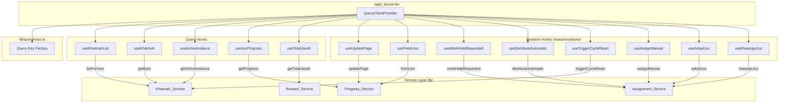
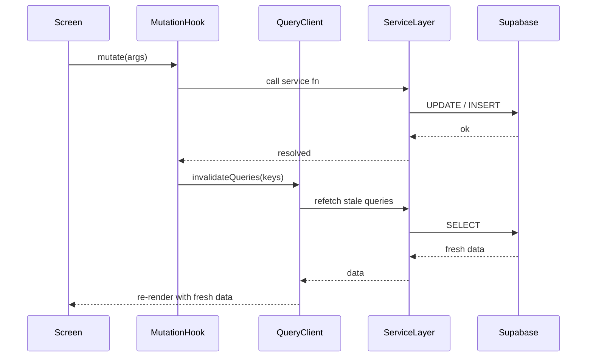

# Design Document: TanStack Query Integration

## Overview

This integration replaces five hand-rolled data-fetching hooks with thin wrappers around TanStack Query's `useQuery` and `useMutation` primitives. Every hook currently duplicates the same ~80-line pattern: `mountedRef`, `retryCountRef`, `retryTimerRef`, manual `loading`/`error` state, a `fetchAndSubscribe` async function, a `scheduleRetry` exponential-backoff function, and a Supabase real-time channel subscription. TanStack Query eliminates all of that boilerplate in one pass.

There is **no real-time subscription layer** in this integration. The existing Supabase channel subscriptions are removed entirely. Data freshness is maintained through two mechanisms only:

1. `refetchOnMount` / `refetchOnWindowFocus` — TanStack Query's built-in re-navigation refetch.
2. `invalidateQueries` on mutation success — targeted cache invalidation after every write.

The result is a codebase where every data-fetching hook is 10–15 lines, every mutation hook is 15–20 lines, and the retry/loading/error lifecycle is owned by a single, well-tested library.

### Package Installation

```bash
npx expo install @tanstack/react-query
```

`@tanstack/react-query` v5 is compatible with React 19 and React Native. No additional peer dependencies are required beyond what is already in the project.

---

## Architecture



### Data Flow: Mutation → Cache Invalidation → Refetch



---

## Components and Interfaces

### QueryClient Singleton (`app/_layout.tsx`)

The `QueryClient` is created **once at module level**, outside the component tree, so it survives re-renders and hot reloads.

```typescript
import { QueryClient, QueryClientProvider } from '@tanstack/react-query'

const queryClient = new QueryClient({
  defaultOptions: {
    queries: {
      staleTime: 60 * 1000,        // 60 seconds
      gcTime: 5 * 60 * 1000,       // 5 minutes
      retry: 2,
    },
  },
})

export default function RootLayout() {
  // ...
  return (
    <QueryClientProvider client={queryClient}>
      <ThemeProvider>
        <Stack screenOptions={{ headerShown: false }} />
      </ThemeProvider>
    </QueryClientProvider>
  )
}
```

### Query Key Factory (`lib/queryKeys.ts`)

All query keys are defined in one place as `as const` tuples. This gives full TypeScript inference and makes invalidation targets explicit and refactor-safe.

```typescript
export const queryKeys = {
  khatmahs: {
    list: (userId: string) => ['khatmahs', 'list', userId] as const,
  },
  khatmah: {
    detail: (khatmahId: string) => ['khatmah', khatmahId] as const,
    activeInstance: (khatmahId: string) =>
      ['khatmah', khatmahId, 'activeInstance'] as const,
  },
  instance: {
    juzProgress: (instanceId: string, juzNum: number) =>
      ['instance', instanceId, 'juzProgress', juzNum] as const,
  },
  profile: {
    totalJazah: (userId: string) => ['profile', userId, 'totalJazah'] as const,
  },
} as const
```

#### Full Query Key Table

| Key Builder | Resulting Tuple | Invalidated By |
|---|---|---|
| `queryKeys.khatmahs.list(userId)` | `['khatmahs', 'list', userId]` | `useTriggerCycleReset` |
| `queryKeys.khatmah.detail(khatmahId)` | `['khatmah', khatmahId]` | *(not currently mutated)* |
| `queryKeys.khatmah.activeInstance(khatmahId)` | `['khatmah', khatmahId, 'activeInstance']` | `useFinishJuz`, `useMarkHelpRequested`, `useDistributeAutomatic`, `useAssignManual`, `useAdoptJuz`, `useReassignJuz`, `useTriggerCycleReset` |
| `queryKeys.instance.juzProgress(instanceId, juzNum)` | `['instance', instanceId, 'juzProgress', juzNum]` | `useUpdatePage` |
| `queryKeys.profile.totalJazah(userId)` | `['profile', userId, 'totalJazah']` | `useFinishJuz` |

### Query Hooks

Each hook is a thin `useQuery` wrapper. The `enabled` guard prevents fetching when required IDs are absent.

#### `useKhatmahList`

```typescript
// hooks/useKhatmahList.ts
import { useQuery } from '@tanstack/react-query'
import { useSession } from '@/hooks/useSession'
import * as Khatmah_Service from '@/lib/khatmah'
import { queryKeys } from '@/lib/queryKeys'

export function useKhatmahList() {
  const { session } = useSession()
  const userId = session?.user.id ?? null

  return useQuery({
    queryKey: queryKeys.khatmahs.list(userId ?? ''),
    queryFn: () => Khatmah_Service.listForUser(userId!),
    enabled: userId != null,
  })
}
// Returns: UseQueryResult<Khatmah[], Error>
// data defaults to [] when disabled (userId null)
```

#### `useKhatmah`

```typescript
// hooks/useKhatmah.ts
export function useKhatmah(khatmahId: string) {
  return useQuery({
    queryKey: queryKeys.khatmah.detail(khatmahId),
    queryFn: () => Khatmah_Service.getById(khatmahId),
    enabled: khatmahId !== '',
  })
}
// Returns: UseQueryResult<Khatmah, Error>
```

#### `useActiveInstance`

```typescript
// hooks/useActiveInstance.ts
export function useActiveInstance(khatmahId: string) {
  return useQuery({
    queryKey: queryKeys.khatmah.activeInstance(khatmahId),
    queryFn: () => Khatmah_Service.getActiveInstance(khatmahId),
    enabled: khatmahId !== '',
  })
}
// Returns: UseQueryResult<KhatmahInstance, Error>
```

#### `useJuzProgress`

```typescript
// hooks/useJuzProgress.ts
export function useJuzProgress(instanceId: string, juzNum: number) {
  return useQuery({
    queryKey: queryKeys.instance.juzProgress(instanceId, juzNum),
    queryFn: () => Progress_Service.getProgress(instanceId, juzNum),
    enabled: instanceId !== '',
  })
}
// Returns: UseQueryResult<number, Error>
```

#### `useTotalJazah`

```typescript
// hooks/useTotalJazah.ts
export function useTotalJazah() {
  const { session } = useSession()
  const userId = session?.user.id ?? null

  return useQuery({
    queryKey: queryKeys.profile.totalJazah(userId ?? ''),
    queryFn: () => Reward_Service.getTotalJazah(userId!),
    enabled: userId != null,
  })
}
// Returns: UseQueryResult<number, Error>
```

### Mutation Hooks

Each mutation hook lives in `hooks/mutations/`. The `onSuccess` callback calls `queryClient.invalidateQueries` with the exact keys from the factory. Errors propagate to the caller via the `UseMutationResult` — no cache modification on failure.

#### `useUpdatePage`

```typescript
// hooks/mutations/useUpdatePage.ts
export function useUpdatePage(instanceId: string, juzNum: number) {
  const queryClient = useQueryClient()
  return useMutation({
    mutationFn: (page: number) =>
      Progress_Service.updatePage(instanceId, juzNum, page),
    onSuccess: () => {
      void queryClient.invalidateQueries({
        queryKey: queryKeys.instance.juzProgress(instanceId, juzNum),
      })
    },
  })
}
```

#### `useFinishJuz`

```typescript
// hooks/mutations/useFinishJuz.ts
export function useFinishJuz(khatmahId: string, userId: string) {
  const queryClient = useQueryClient()
  return useMutation({
    mutationFn: ({ instanceId, juzNum }: { instanceId: string; juzNum: number }) =>
      Progress_Service.finishJuz(instanceId, juzNum),
    onSuccess: (_data, { instanceId, juzNum }) => {
      void queryClient.invalidateQueries({
        queryKey: queryKeys.khatmah.activeInstance(khatmahId),
      })
      void queryClient.invalidateQueries({
        queryKey: queryKeys.instance.juzProgress(instanceId, juzNum),
      })
      void queryClient.invalidateQueries({
        queryKey: queryKeys.profile.totalJazah(userId),
      })
    },
  })
}
```

#### `useMarkHelpRequested`

```typescript
// hooks/mutations/useMarkHelpRequested.ts
export function useMarkHelpRequested(khatmahId: string) {
  const queryClient = useQueryClient()
  return useMutation({
    mutationFn: ({ instanceId, juzNum }: { instanceId: string; juzNum: number }) =>
      Assignment_Service.markHelpRequested(instanceId, juzNum),
    onSuccess: () => {
      void queryClient.invalidateQueries({
        queryKey: queryKeys.khatmah.activeInstance(khatmahId),
      })
    },
  })
}
```

#### `useDistributeAutomatic`

```typescript
// hooks/mutations/useDistributeAutomatic.ts
export function useDistributeAutomatic(khatmahId: string) {
  const queryClient = useQueryClient()
  return useMutation({
    mutationFn: ({ instanceId, mode }: { instanceId: string; mode: 'random' | 'sequential' }) =>
      Assignment_Service.distributeAutomatic(instanceId, mode),
    onSuccess: () => {
      void queryClient.invalidateQueries({
        queryKey: queryKeys.khatmah.activeInstance(khatmahId),
      })
    },
  })
}
```

#### `useAssignManual`

```typescript
// hooks/mutations/useAssignManual.ts
export function useAssignManual(khatmahId: string) {
  const queryClient = useQueryClient()
  return useMutation({
    mutationFn: (args: { instanceId: string; juzNum: number; userId: string; userFullName: string }) =>
      Assignment_Service.assignManual(args.instanceId, args.juzNum, args.userId, args.userFullName),
    onSuccess: () => {
      void queryClient.invalidateQueries({
        queryKey: queryKeys.khatmah.activeInstance(khatmahId),
      })
    },
  })
}
```

#### `useAdoptJuz`

```typescript
// hooks/mutations/useAdoptJuz.ts
export function useAdoptJuz(khatmahId: string) {
  const queryClient = useQueryClient()
  return useMutation({
    mutationFn: (args: { instanceId: string; juzNum: number; adopterId: string; adopterFullName: string }) =>
      Assignment_Service.adoptJuz(args.instanceId, args.juzNum, args.adopterId, args.adopterFullName),
    onSuccess: () => {
      void queryClient.invalidateQueries({
        queryKey: queryKeys.khatmah.activeInstance(khatmahId),
      })
    },
  })
}
```

#### `useReassignJuz`

```typescript
// hooks/mutations/useReassignJuz.ts
export function useReassignJuz(khatmahId: string) {
  const queryClient = useQueryClient()
  return useMutation({
    mutationFn: (args: { instanceId: string; juzNum: number; newUserId: string; newUserFullName: string }) =>
      Assignment_Service.reassignJuz(args.instanceId, args.juzNum, args.newUserId, args.newUserFullName),
    onSuccess: () => {
      void queryClient.invalidateQueries({
        queryKey: queryKeys.khatmah.activeInstance(khatmahId),
      })
    },
  })
}
```

#### `useTriggerCycleReset`

```typescript
// hooks/mutations/useTriggerCycleReset.ts
export function useTriggerCycleReset(khatmahId: string, userId: string) {
  const queryClient = useQueryClient()
  return useMutation({
    mutationFn: () => Khatmah_Service.triggerCycleReset(khatmahId),
    onSuccess: () => {
      void queryClient.invalidateQueries({
        queryKey: queryKeys.khatmah.activeInstance(khatmahId),
      })
      void queryClient.invalidateQueries({
        queryKey: queryKeys.khatmahs.list(userId),
      })
    },
  })
}
```

---

## Data Models

No new data models are introduced. The integration operates entirely on the existing domain types from `types/khatmah.ts` and the existing service return types. The only new data structure is the query key factory, which produces typed `readonly` tuples.

### Query Key Types (inferred)

```typescript
type KhatmahListKey     = readonly ['khatmahs', 'list', string]
type KhatmahDetailKey   = readonly ['khatmah', string]
type ActiveInstanceKey  = readonly ['khatmah', string, 'activeInstance']
type JuzProgressKey     = readonly ['instance', string, 'juzProgress', number]
type TotalJazahKey      = readonly ['profile', string, 'totalJazah']
```

These are inferred automatically from the `as const` factory — no manual type declarations needed.

### Screen Migration Summary

#### `app/_layout.tsx`

- Add module-level `QueryClient` singleton
- Wrap `<ThemeProvider>` with `<QueryClientProvider client={queryClient}>`

#### `app/(app)/khatmah/[id]/index.tsx`

| Before | After |
|---|---|
| `useKhatmah(id)` → `{ khatmah, loading, error, reconnecting }` | `useKhatmah(id)` → `{ data: khatmah, isLoading, isError }` |
| `useActiveInstance(id)` → `{ instance, loading, reconnecting, refresh }` | `useActiveInstance(id)` → `{ data: instance, isLoading, isError }` |
| `useFocusEffect(useCallback(() => { refresh() }, [refresh]))` | **removed** — TanStack Query's `refetchOnMount` handles this |
| `await distributeAutomatic(instance.id, 'random')` then `refresh()` | `distributeAutomatic.mutate(...)` — invalidation is automatic |
| `await triggerCycleReset(id)` then manual state | `triggerCycleReset.mutate()` — invalidation is automatic |
| `await markHelpRequested(...)` then `refresh()` | `markHelpRequested.mutate(...)` |
| `await adoptJuz(...)` then `refresh()` | `adoptJuz.mutate(...)` |
| `await reassignJuz(...)` then `refresh()` | `reassignJuz.mutate(...)` |
| `await assignManual(...)` then `refresh()` | `assignManual.mutate(...)` |
| `<ReconnectBanner visible={reconnecting} />` | **removed** — no reconnect state |

#### `app/(app)/khatmah/[id]/juz/[num].tsx`

| Before | After |
|---|---|
| `useActiveInstance(id)` → `{ instance, loading, refresh }` | `useActiveInstance(id)` → `{ data: instance, isLoading }` |
| `useJuzProgress(instance?.id, juzNum)` → `{ currentPage, loading }` | `useJuzProgress(instanceId, juzNum)` → `{ data: currentPage, isLoading }` |
| `await updatePage(...)` then `refresh()` | `updatePage.mutate(page)` |
| `await finishJuz(...)` then `refresh()` | `finishJuz.mutate({ instanceId, juzNum })` |
| `await markHelpRequested(...)` then `refresh()` | `markHelpRequested.mutate({ instanceId, juzNum })` |

---

## Correctness Properties

*A property is a characteristic or behavior that should hold true across all valid executions of a system — essentially, a formal statement about what the system should do. Properties serve as the bridge between human-readable specifications and machine-verifiable correctness guarantees.*

### Property Reflection

Before listing properties, redundancy is eliminated:

- Requirements 8.2–8.9 all share the same shape: "for any valid IDs, after mutation success, the target cache key is invalidated." Rather than one property per mutation, these are consolidated into two properties: one for single-key invalidation (activeInstance mutations) and one for multi-key invalidation (finishJuz, triggerCycleReset).
- Requirements 9.1 and 9.2 are both round-trip properties. They are kept separate because they target different domain types (KhatmahInstance vs Khatmah) and different query keys.
- Requirement 9.3 (key uniqueness) and Requirement 1.6 (key factory produces typed tuples) both test the query key factory. They are consolidated into one property covering both stability and non-collision.
- Requirement 8.10 (mutation failure does not modify cache) is a standalone property with no redundancy.

---

### Property 1: Query key stability and non-collision

*For any* two calls to the same key-builder function with the same arguments, the resulting tuples must be deeply equal. *For any* two calls to different key-builder functions, or the same function with different arguments, the resulting tuples must not be deeply equal.

**Validates: Requirements 1.6, 9.3**

---

### Property 2: Single-target mutation invalidates its cache key

*For any* valid `khatmahId` string, after any of the following mutations succeeds — `useMarkHelpRequested`, `useDistributeAutomatic`, `useAssignManual`, `useAdoptJuz`, `useReassignJuz` — the cache entry at `queryKeys.khatmah.activeInstance(khatmahId)` shall be marked stale (invalidated), causing the next consumer to trigger a refetch.

**Validates: Requirements 8.4, 8.5, 8.6, 8.7, 8.8**

---

### Property 3: Multi-target mutations invalidate all expected cache keys

*For any* valid `khatmahId` and `userId`:

- After `useFinishJuz` succeeds, both `queryKeys.khatmah.activeInstance(khatmahId)` and `queryKeys.profile.totalJazah(userId)` shall be invalidated.
- After `useTriggerCycleReset` succeeds, both `queryKeys.khatmah.activeInstance(khatmahId)` and `queryKeys.khatmahs.list(userId)` shall be invalidated.

**Validates: Requirements 8.3, 8.9**

---

### Property 4: Mutation failure leaves cache unchanged

*For any* mutation hook, when the underlying service function rejects with an error, the mutation result shall have `isError === true` and the cache entries that would have been invalidated on success shall remain in their pre-mutation state (not invalidated, not modified).

**Validates: Requirement 8.10**

---

### Property 5: Mutation → invalidation → refetch round trip (KhatmahInstance)

*For any* write operation that modifies a `KhatmahInstance` field (juz assignment, completion, help-requested, current page), after the mutation succeeds and `invalidateQueries` fires, the subsequent `useActiveInstance` or `useJuzProgress` refetch shall return data whose relevant fields reflect the values written by the mutation.

**Validates: Requirements 9.1**

---

## Error Handling

### Query Errors

TanStack Query handles retry automatically (2 retries, exponential backoff by default). After exhausting retries, the query enters `isError` state. Screens should:

1. Check `isError` and render an error message.
2. Expose a retry affordance that calls `refetch()` from the query result.

```typescript
const { data, isLoading, isError, refetch } = useKhatmahList()

if (isError) {
  return <ErrorView onRetry={refetch} />
}
```

No custom error boundaries are required — the existing per-screen error rendering pattern is sufficient.

### Mutation Errors

Mutation errors surface via `mutation.isError` and `mutation.error`. The calling component is responsible for displaying the error (e.g. `Alert.alert`). The cache is never modified on failure — no rollback logic is needed.

```typescript
const updatePage = useUpdatePage(instanceId, juzNum)

// In handler:
updatePage.mutate(page, {
  onError: (err) => Alert.alert(t('khatmah.error'), err.message),
})
```

### Disabled Queries

When `enabled: false` (null userId or empty instanceId), the query stays in `fetchStatus: 'idle'` with `data: undefined`. Screens should guard against `undefined` data the same way they currently guard against `null`.

### ValidationError from Progress_Service

`Progress_Service.updatePage` throws a `ValidationError` for out-of-range pages. This propagates through `useMutation` as `mutation.error`. The Juz' detail screen checks `err instanceof ValidationError` to show the localised range error message — this logic moves from the `try/catch` block into the mutation's `onError` callback.

---

## Testing Strategy

### Dual Testing Approach

Unit tests cover specific examples, edge cases, and error conditions. Property-based tests verify universal properties across many generated inputs. Both are necessary.

### Property-Based Testing Library

Use **[fast-check](https://github.com/dubzzz/fast-check)** — the standard PBT library for TypeScript/JavaScript. It integrates with Jest/Vitest and supports React Native environments.

```bash
npm install --save-dev fast-check
```

Each property test runs a minimum of **100 iterations** (fast-check default). Tag format in test comments:

```
// Feature: tanstack-query-integration, Property N: <property text>
```

### Property Test Implementations

**Property 1 — Key stability and non-collision** (`lib/queryKeys.test.ts`)

```typescript
// Feature: tanstack-query-integration, Property 1: key stability and non-collision
fc.assert(fc.property(
  fc.uuid(), fc.uuid(), fc.integer({ min: 1, max: 30 }),
  (id1, id2, juzNum) => {
    // Stability: same args → same key
    expect(queryKeys.khatmah.detail(id1)).toEqual(queryKeys.khatmah.detail(id1))
    // Non-collision: different args → different key
    if (id1 !== id2) {
      expect(queryKeys.khatmah.detail(id1)).not.toEqual(queryKeys.khatmah.detail(id2))
    }
    // Cross-builder non-collision: same id, different builders
    expect(queryKeys.khatmah.detail(id1))
      .not.toEqual(queryKeys.khatmah.activeInstance(id1))
    expect(queryKeys.khatmah.activeInstance(id1))
      .not.toEqual(queryKeys.instance.juzProgress(id1, juzNum))
  }
))
```

**Property 2 — Single-target invalidation** (`hooks/mutations/__tests__/invalidation.test.ts`)

```typescript
// Feature: tanstack-query-integration, Property 2: single-target mutation invalidates cache key
fc.assert(fc.property(fc.uuid(), async (khatmahId) => {
  const queryClient = new QueryClient()
  // Pre-populate cache
  queryClient.setQueryData(queryKeys.khatmah.activeInstance(khatmahId), mockInstance)
  // Run mutation with mocked service
  const { result } = renderHook(() => useMarkHelpRequested(khatmahId), { wrapper })
  await act(() => result.current.mutate({ instanceId: 'inst-1', juzNum: 1 }))
  // Assert invalidation
  const state = queryClient.getQueryState(queryKeys.khatmah.activeInstance(khatmahId))
  expect(state?.isInvalidated).toBe(true)
}))
```

**Property 3 — Multi-target invalidation** (`hooks/mutations/__tests__/invalidation.test.ts`)

```typescript
// Feature: tanstack-query-integration, Property 3: multi-target mutations invalidate all expected keys
fc.assert(fc.property(fc.uuid(), fc.uuid(), async (khatmahId, userId) => {
  // finishJuz invalidates activeInstance + totalJazah
  // triggerCycleReset invalidates activeInstance + khatmahs.list
  // ... (assert both keys invalidated after each mutation)
}))
```

**Property 4 — Failure leaves cache unchanged** (`hooks/mutations/__tests__/errorHandling.test.ts`)

```typescript
// Feature: tanstack-query-integration, Property 4: mutation failure leaves cache unchanged
fc.assert(fc.property(fc.uuid(), async (khatmahId) => {
  const queryClient = new QueryClient({ defaultOptions: { queries: { retry: 0 }, mutations: { retry: 0 } } })
  queryClient.setQueryData(queryKeys.khatmah.activeInstance(khatmahId), mockInstance)
  // Mock service to reject
  const { result } = renderHook(() => useMarkHelpRequested(khatmahId), { wrapper })
  await act(() => result.current.mutate({ instanceId: 'inst-1', juzNum: 1 }))
  expect(result.current.isError).toBe(true)
  // Cache unchanged
  expect(queryClient.getQueryData(queryKeys.khatmah.activeInstance(khatmahId))).toEqual(mockInstance)
}))
```

**Property 5 — Round-trip data integrity** (`hooks/mutations/__tests__/roundTrip.test.ts`)

```typescript
// Feature: tanstack-query-integration, Property 5: mutation → invalidation → refetch round trip
fc.assert(fc.property(
  fc.uuid(), fc.integer({ min: 1, max: 30 }), fc.integer({ min: 1, max: 604 }),
  async (instanceId, juzNum, page) => {
    // Mock updatePage to succeed, mock getProgress to return `page`
    const { result } = renderHook(() => useUpdatePage(instanceId, juzNum), { wrapper })
    await act(() => result.current.mutate(page))
    // After invalidation + refetch, useJuzProgress returns the written page
    const { result: progressResult } = renderHook(
      () => useJuzProgress(instanceId, juzNum), { wrapper }
    )
    await waitFor(() => expect(progressResult.current.data).toBe(page))
  }
))
```

### Unit Tests

Unit tests cover:

- **QueryClient configuration**: `staleTime`, `gcTime`, `retry` values (smoke checks).
- **Hook disabled state**: `enabled: false` when userId/instanceId is empty — `fetchStatus === 'idle'`.
- **Loading state**: `isLoading === true` before queryFn resolves.
- **Error state**: `isError === true` after queryFn rejects (with retry: 0 in test config).
- **ValidationError propagation**: `useUpdatePage` surfaces `ValidationError` via `mutation.error`.

### Integration Tests

Integration tests (run against a local Supabase instance) cover:

- End-to-end mutation → DB write → refetch → correct data returned.
- `triggerCycleReset` creates a new instance row and the list query reflects the updated khatmah status.

These are run separately from unit/property tests and are not part of the CI fast path.
